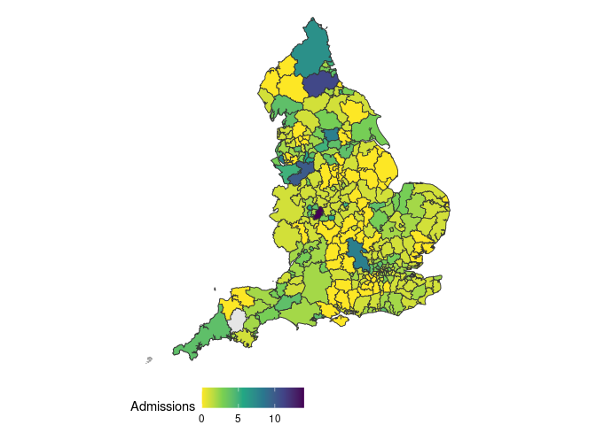
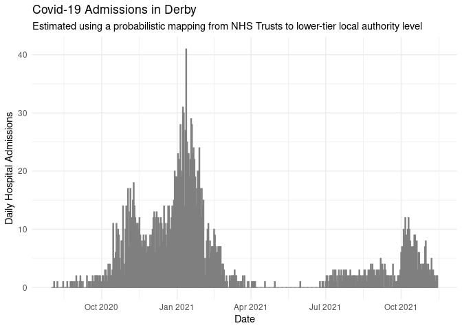

# Trust-level COVID-19 hospitalisations in England

[](https://www.tidyverse.org/lifecycle/#experimental)
[](https://github.com/epiforecasts/covid19.nhs.data/actions)
[](https://codecov.io/gh/epiforecasts/covid19.nhs.data?branch=master)

This package contains a many-to-many mapping between local authority
districts and NHS Acute Trusts in England; details of this mapping
(including a summary of the methods and a quick-start guide) can be
found in
[vignettes/mapping-summary](https://github.com/epiforecasts/covid19.nhs.data/tree/main/vignettes/mapping-summary).

This package also has functionality to download trust-level hospital
admissions data, published weekly on the [NHS COVID-19 Hospital
Activity](https://www.england.nhs.uk/statistics/statistical-work-areas/covid-19-hospital-activity/)
webpage. Data published on date `YYYY-MM-DD` can be downloaded using the
function `get_admissions(release_date = "YYYY-MM-DD")`. This function
can also be used to return estimated admissions by upper-tier and
lower-tier local authorities. See the quick start below, the vignettes,
and the package documentation for more.

## Installation

Install the stable development version of the package using
[`{drat}`](https://epiforecasts.io/drat/):

``` r
install.packages("drat")
drat:::add("epiforecasts")
install.packages("covid19.nhs.data")
```

Install the unstable development version of the package with:

``` r
remotes::install_github("epiforecasts/covid19.nhs.data")
```

## Quick start

Load the package.

``` r
library(covid19.nhs.data)
```

Download the latest admissions mapped to lower-tier local authority
(LTLA) using the default mapping. *Note: This data is updated weekly
each Thursday and the mapping is a probabilistic estimate.*

``` r
adm <- get_admissions("ltla")
```

Map the latest available estimates by LTLA using one of the built in
package shapefiles.

``` r
map_admissions(adm, england_ltla_shape)
```

<!-- -->

Plot the time series of estimated admissions in an example LTLA (here
Derby).

``` r
library(ggplot2)
library(dplyr)
#> 
#> Attaching package: 'dplyr'
#> The following objects are masked from 'package:stats':
#> 
#>     filter, lag
#> The following objects are masked from 'package:base':
#> 
#>     intersect, setdiff, setequal, union

adm %>% 
  filter(geo_name %in% "Derby") %>% 
  ggplot(aes(x = date, y = admissions)) + 
  geom_col(width = 0.9, col = "grey50", fill = "grey85") +
  theme_minimal() +
  labs(x = "Date", y = "Daily Hospital Admissions",
       title = "Covid-19 Admissions in Derby", 
       subtitle = "Estimated using a probalistic mapping from NHS Trusts to lower-tier local authority level")
```

<!-- -->
